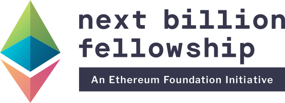

<p align="center">
  
</p>
<h1 align="center">
  Ethereum Foundation Fellowship Program
</h1>

The Ethereum Foundation Fellowship Program is an opportunity to experiment with using Ethereum to help solve pressing social, economic, and environmental challenges in developing countries.

This repository holds the codebase to our website, [fellowship.ethereum.foundation](https://fellowship.ethereum.foundation)

## Local development

1. [Set up your development environment](https://www.gatsbyjs.org/tutorial/part-zero/)

2. Clone this project

```
$ git clone git@github.com:ethereum/fellowship-program-website.git && cd fellowship-program-website

```

3. Install dependencies

```
$ yarn
```

4. Start developing!

```
yarn develop
```

## Learning Gatsby

Full documentation for Gatsby lives [on the website](https://www.gatsbyjs.org/). Here are some places to start:

- **For most developers, we recommend starting with our [in-depth tutorial for creating a site with Gatsby](https://www.gatsbyjs.org/tutorial/).** It starts with zero assumptions about your level of ability and walks through every step of the process.

- **To dive straight into code samples, head [to our documentation](https://www.gatsbyjs.org/docs/).** In particular, check out the _Guides_, _API Reference_, and _Advanced Tutorials_ sections in the sidebar.
