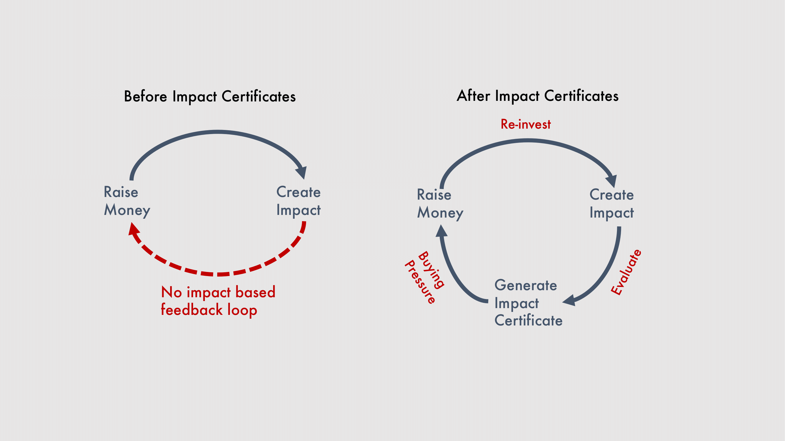
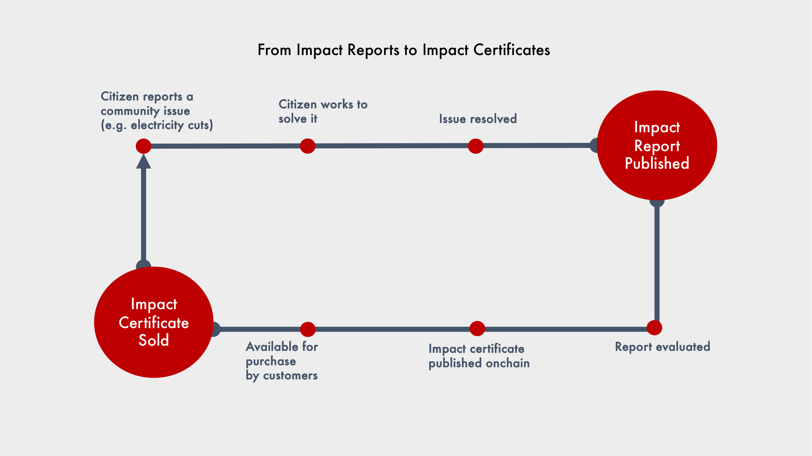

# Piloting Journalism Impact Certificates, a new blockspace frontier

As an investigative journalist, I have published stories at newsrooms like the Organized Crime and Corruption Reporting Project and CGNet Swara. Both newsrooms, like many investigative outlets, face a common problem: while many of their stories create tangible outcomes, the impact rarely translates into sustainable revenue. In response, I experimented with alternative revenue models like distributing news via WhatsApp API and Bluetooth, and even paying readers to listen to ads!

But the fundamental issue remained: how do we create a feedback loop where real-world outcomes of journalists’ work directly fuels their revenue?

# Outcome-based Funding: A Potential Solution

In outcome-based funding, money is given based on results, not just effort or promises. In the case of journalism, for example, traditional funding may support the process (like writing, investigating, and publishing), whereas outcome-based funding rewards the results (like a criminal being arrested and a policy change). 

The most prominent instrument of outcome-based funding is social impact bonds, where investors provide upfront capital, repaid with interest if predefined outcome targets are met. Since 2010, there have been 300 impact bonds raising around USD 750 million to serve 2.5 million globally. 

Despite its innovation, however, outcome-based funding has had relatively low uptake for 3 main reasons:

1. Organizations focus on easy-to-achieve outcomes at the expense of more difficult ones  
2. Only deep-pocketed funders use it since there are high setup costs, with one study finding a required ticket size of at least USD 20 million to be viable  
3. Risk of overpayment of outcomes that may have occurred even without the intervention or insufficiently capture meaningful change

# Outcome-based Funding, On-chain

In August 2021, I stumbled upon the concept of a non-fungible token: using a blockchain to create unique digital objects. I saw that this could be applied to social impact bonds to replicate key features like single sale of outcomes while lowering setup costs and need for big funders. Blockchain-powered outcome funding could become a new approach to fundraising in the social sector by shifting from an existing service contract model (i.e., grants, donations) to a disruptive, product sales approach via certificates of impact. 

Think of the experience of buying a t-shirt: you go to a shop, inspect the quality, and purchase it directly. Imagine that same experience for buying impact. You can see some verified, achieved outcome, look at the price at which it was achieved, and then purchase it. 

The idea of impact certificates was first brought up in 2014 by Paul Christiano on the Effective Altruism forum. He saw it as a coordination mechanism, bringing together people with the ability to undertake a project, means to fund it, and knowledge to evaluate it, premised around creating positive feedback loops between impact creation and revenue generation.

Even back then, Paul [proposed](https://paulfchristiano.medium.com/certificates-of-impact-34fa4621481e) the use of a blockchain to solve the issue of double spending, where the same impact might be sold multiple times. However, it wasn’t until [Hypercerts](https://www.hypercerts.org/)—digital tokens that represent the impact of some work—launched last year that a clear standard for impact certificates came into existence.

# Building Version One: Journalism Impact Certificates

As part of the Ethereum Foundation’s Next Billion Fellowship, I attended a global investigative journalism conference in Gothenburg to get feedback from journalists on outcome-based funding for their past work. Seeing some initial [validation](https://x.com/TheDevanshMehta/status/1708818000093294810) of the idea, I drew up a prototype that received some initial funding, from Funding the Commons and Scott Alexander, who is a leader in the rationalist community. The project was also [featured](https://www.astralcodexten.com/p/impact-market-mini-grants-results?hide_intro_popup=true) on his widely read blog, Astral Codex Ten. Additionally, the product accellerator [Pollen Labs](https://pollenlabs.org/) provided crucial design and development help to the project.

We then started collaborations with three social enterprises to bring on chain their past impact—such as getting a human trafficker arrested and suspending a teacher stealing from a lunch program. Each verified outcome was priced, quantified, and made available for purchase by customers.

After a testnet launch, the marketplace of journalism impact went live in November 2024\. That same month, at Devcon SEA, I gave [a talk](https://app.devcon.org/schedule/SJE7VP) about all the support provided in the Ethereum ecosystem to manifest an idea, from Gitcoin quadratic funding rounds that keep the mission alive, to hackathons for recruiting team members, to initiatives like Pollen Labs and the Next Billion Fellowship Program. 

Since the launch, 13 supporters have bought $125 in impact certificates. The project’s repository has had two prominent forks for taking outcome-based funding to other domains. A writeup on our implementation of outcome-based online donations was [published](https://dl.acm.org/doi/abs/10.1145/3678884.3687146) at a top peer-reviewed conference called Computer Supported Cooperative Work (CSCW), showcasing a new blockchain use case to internet researchers outside web3.

# What’s next? 

Going ahead, the plan is tapping into three markets for driving more buyers to impact certificates: existing media funders; algorithmic funding platforms like Gitcoin, Ooctant, and Public Nouns-type DAOs; and the gift card market.

Every impact certificate has space for its buyers to write a comment showing their gratitude to a person on a special occasion. Why give a material gift to someone when you can buy an already-achieved impact advancing a cause they care about?

On that note, if you liked this article you can leave a comment expressing your appreciation by buying an impact certificate (for any amount) at [app.voicedeck.org](http://app.voicedeck.org/).

*Special thanks to Nidhi Harihar for reviewing the draft and providing comments*
