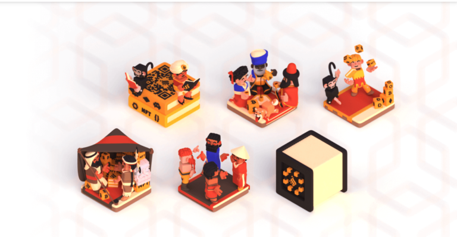

## Karam Alhamad
**Karam Alhamad** is an entrepreneur, fintech visionary, international development professional, and human rights policy advocate. Karam founded [ZeFi,](https://zefi.com/en) an educational platform and community focused on fostering blockchain education and research custom-fit for the Syrian context. For the Fellowship, Karam conducted research that increases practical and culturally-sensitive understandings of how blockchains can solve problems in conflict settings.

---

For over a decade working in the international aid and development sector, I’ve grappled with some troubling questions: Are our traditional systems really equipped to respond to large-scale humanitarian crises? Are the powerful and wealthy institutions committed to protecting the world’s most vulnerable humans really doing all they can? Can we do better? How?

Through my Fellowship at the Ethereum Foundation, I’ve conducted research and seen firsthand that public blockchain protocols like Ethereum are more than a neat innovation – For people caught in humanitarian crises - from Syria to Myanmar, Lebanon, and beyond - where conflicts and crises erode trust in fundamental technologies and where authoritarian regimes and centralized power structures have shaken collective trust in institutions, emerging technologies can be a lifeline in times of unimaginable human suffering, and they represent a glimpse into a future model of crisis response unencumbered by borders and institutional inertia.

---

https://blog.ethereum.org/2023/11/15/beyond-borders-nb
