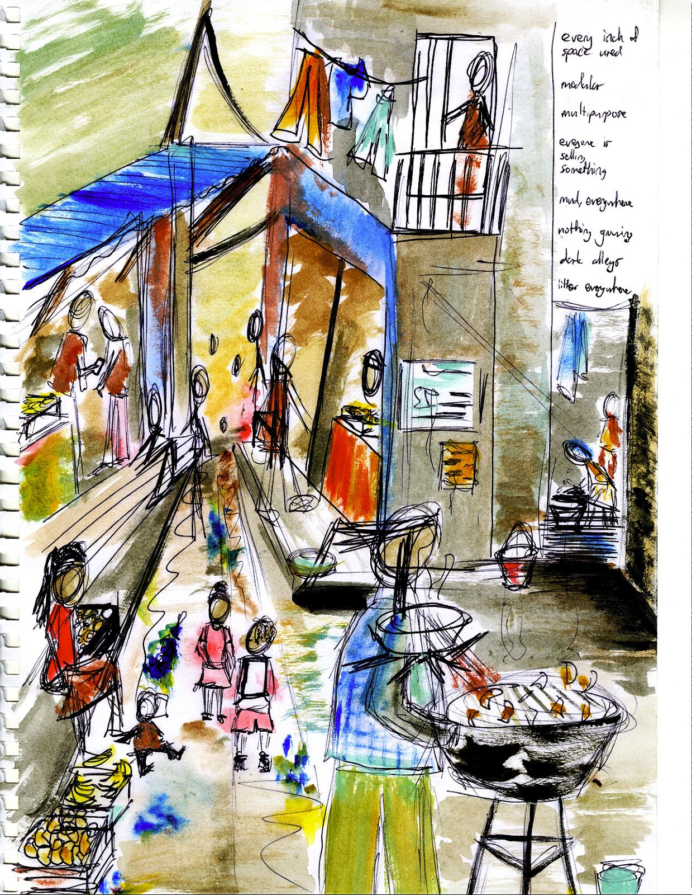
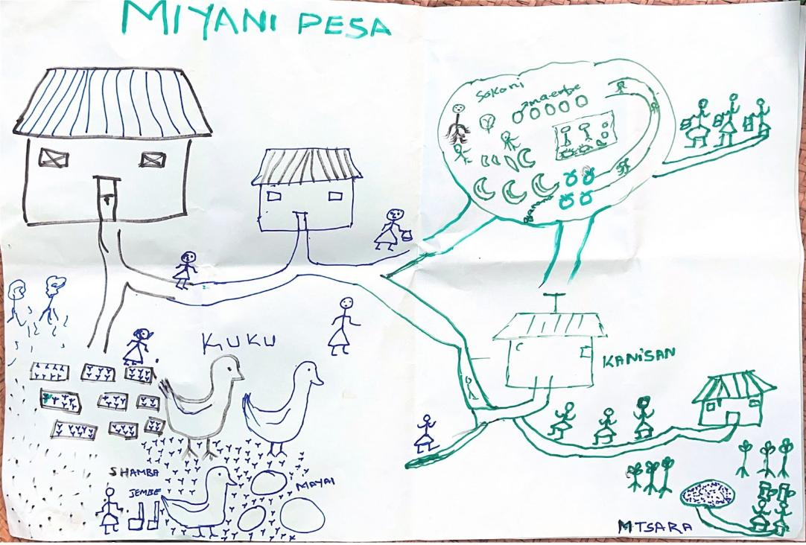
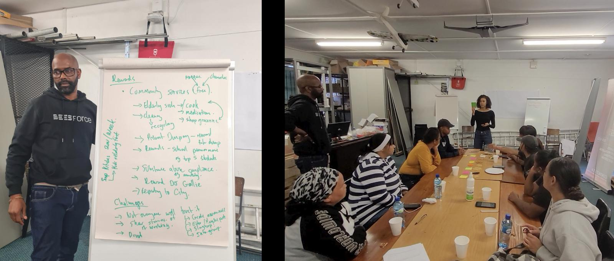

When I started working with Grassroots Economics in 2018, community currencies were making a comeback as tools for hyperlocal economic empowerment. Across history, local-based monetary systems have been explored as a way to keep money circulating within communities—ranging from Switzerland's WIR Bank, created in 1934 in response to interwar currency shortages, to Canada's Local Exchange Trading Systems (LETs) and the Bristol Pound in the UK.

Blockchain technology seemed to offer a fresh opportunity for these models, addressing long-standing challenges of scalability and trust.

Yet as the field evolved—from paper vouchers to on-chain tokens—practitioners found themselves boxed into narrow monetary frameworks. The focus on "currency" emphasized fungibility and transactional efficiency, often neglecting the relational and communal aspects of what makes a healthy economy.

By 2023, Grassroots Economics took a bold step away from the concept of "currency" altogether. They introduced **commitment pooling**, a socio-economic protocol that aggregates individual promises—hours of labor, goods, or services—into a shared community resource. With most of their operations in Kenya, much of the process involved reviving indigenous traditions around mutual aid.

As I witnessed "old technology" merge with "new technology", it marked a turning point in how I thought about cryptocurrency and my role as a designer and practitioner. Whereas before, my focus had been on tools – the bells and whistles of onchain community currencies that doubled as smart contracts – my work for nearly a decade in places like Nairobi, Mombasa, Cape Town, Oakland and Jackson, Mississippi prompted a very different orientation to the work.

I began to see community currencies not as monetary innovations but as **social technologies**—extensions of long-standing mutual aid practices like Kenya's *mweriya* or South Africa's *stokvels*. These practices don't thrive because of the novelty of the tool, but because of the relationships they sustain. 

In this blog post, I'll discuss what makes commitment pooling different from "standard" community currencies and some of the lessons learned from doing this work across cultural and geographic contexts.

*Watercolor and pen sketch of a market in Nairobi, Kenya*

# Commitment pooling: Old technology, new affordances

*The future of Miyani Pesa (a community asset voucher on sarafu.network) as illustrated by community members in Kinango Kwale, Kenya. What happens when we start to map economic prosperity as a function of place-based relationships? Photo: Patricia Marcella Evite*

Commitment pooling is best described as a socio-economic protocol. The social part is in voicing and honoring these commitments – a process that happens largely in person and follows a set cadence, borrowing from indigenous mutual aid practices like Kenya's *mweria*. The economic part is that these commitments live as ERC20 vouchers on the Celo blockchain and can be swapped, pooled and staked.

>*\[It\] sometimes felt strange to apply a complex jumble of modern economic concepts to social circumstances in Africa. The ideas did not have clear grounding in the cultural situation of the communities. As a result, we \[saw\] some groups performing worse than others, which prompted an inquiry. It turns out that a social contract among voucher-issuing groups was the key to their sustained \[impact\].*
>
>— Will Ruddick (2024), Founder of Grassroots Economics

Commitment pooling decouples resource coordination from the constraints of traditional money. In classical economics, currency serves as a universal medium of exchange. In contrast, commitment pooling treats vouchers as promises—formalized commitments that circulate within an existing network of trust.

Here's how it works:

* **Curation**: Communities decide which commitments qualify for the pool—be it labor, goods, or services.  
* **Valuation**: Relative values are assigned, creating a basis for exchange.  
* **Limitation**: Caps are set to prevent over-dependence on any single resource or contributor.  
* **Exchange Logic**: Additional rules govern how commitments move in and out of the pool (for example, ensuring equity and sustainability).

These principles are not new. In fact, they draw directly from indigenous practices like Kenya's *mweriya*, where communities pool labor for collective projects, or South Africa's *stokvels*, which organize shared savings. The commitment pooling protocol digitizes these practices, formalizing promises into a shared pool and leveraging decentralized technology to efficiently coordinate resources. 

These traditions thrive not because of the novelty of the tool but because of the relationships they sustain. But how do these relationships inform the design of new economic systems? What does trust look like in different contexts, and how can financial tools be shaped to support existing ways of exchanging value? These were some of the questions I explored during my fellowship, beginning with the community in Ocean View, Cape Town.

# Ocean View and the Krone Voucher Experiment

Ocean View, Cape Town is a small community tucked along the edge of Table Mountain National Park. Most families here were displaced in the 1960s from nearby Simon's Town, Noordhoek, Fish Hoek, and Glencairn under the Apartheid Group Areas Act. In an act of defiance, residents renamed their new home from "Slangkop" to "Ocean View" in memory of the coastal places they were forced to leave.

That defiance continues in the work and vision of many local activists today. Within less than a 2x2 km radius, Ocean View boasts its own WiFi mesh network, aquaponics farm, and a long-held dream of a community-owned alternative economy. During my fellowship, I worked with the Ocean View community to explore how Grassroots Economic's Community Asset Vouchers and Commitment Pooling protocol could be incorporated into their existing infrastructure of self-sustaining initiatives.

We hosted [several workshops](https://www.inethi.org.za/2024/10/18/intro-to-krone-workshop-in-ocean-view-25-may-2024/) to introduce the concept, starting with mapping existing assets in the community. The idea was simple: could Ocean View residents use Community Asset Vouchers (CAVs) to pay for internet access, trade local services, and reward community contributions? Instead of waiting for external funding, could they create their own economy based on shared commitments?

*Community workshop in Ocean View, South Africa. Photo: Rebecca Mqamelo*

### **Inside the workshops: challenges and insights**

#### **1\. Who defines value?**

One of the first hurdles was defining what should be rewarded. Participants debated whether Krone should be reserved for essential services (e.g., food, transport) or if it could also be used for creative labor (e.g., musicians contributing to community radio). Some participants worried that certain contributions, like childcare or waste collection, would be undervalued compared to more visible economic activities like selling food.

This raised a fundamental design question: How do you ensure that a voucher-based economy reflects the values of a community, rather than replicating existing inequalities?

#### **2\. How do people actually use the voucher?**

Another challenge was usability. In our second workshop, we explored the UX of how participants might send, receive, and store Krone. Role-playing exercises revealed unexpected design gaps:

* Many participants wanted to know who they were transacting with before accepting Krone. This led to discussions about trust scores and reputation tracking.  
* Some worried about losing access to their funds if they forgot a PIN or lost a phone, prompting ideas around social recovery mechanisms (e.g., designating a trusted contact for password resets).  
* For business owners, integrating Krone into their daily operations raised logistical concerns—how would they advertise that they accept Krone? Would customers understand how to use it?

#### **3\. Missing social Infrastructure**

The biggest challenge, however, wasn't technical—it was social infrastructure. Unlike in Kenya, where *chamas* (table banking groups) and *mweriya* (indigenous rotational labour practices) provide a strong foundation for resource pooling, Ocean View had fewer formalized traditions of economic reciprocity. 

This mirrored something I'd seen while running similar workshops in the US. A major barrier was the absence of strong pre-existing networks of mutual aid. As one participant in an Atlanta workshop put it: 

>In Kenya, you have an abundance of social capital but scarce resources. In the U.S., we comparatively have excess resources but a scarcity of trust.

The lesson here was clear: new economic tools cannot create trust—they can only amplify or formalize what already exists.

# Conclusion

Traditional monetary systems often erode social bonds, commodifying relationships and concentrating power. Protocols like commitment pooling offer a different approach—one that centers reciprocity, trust, and collective agency. 

But as Ocean View showed, trust isn't a given; it's shaped by history, culture, and lived experience. In some places, resource-sharing traditions make these models intuitive, while in others, trust must be nurtured before new systems can take root.

From Ocean View to Jackson, one thing is clear: economies work best when they serve relationships, not the other way around. By shifting from currency to commitments, we open the door to more just, resilient, and community-driven ways of exchanging value.

If you're interested in supporting this work, check out [sarafu.network](https://sarafu.network/) to see Community Asset Vouchers live in action. If you're web3 native, consider [staking to make direct financial contributions to this work](https://www.grassrootseconomics.org/pages/get-involved).
