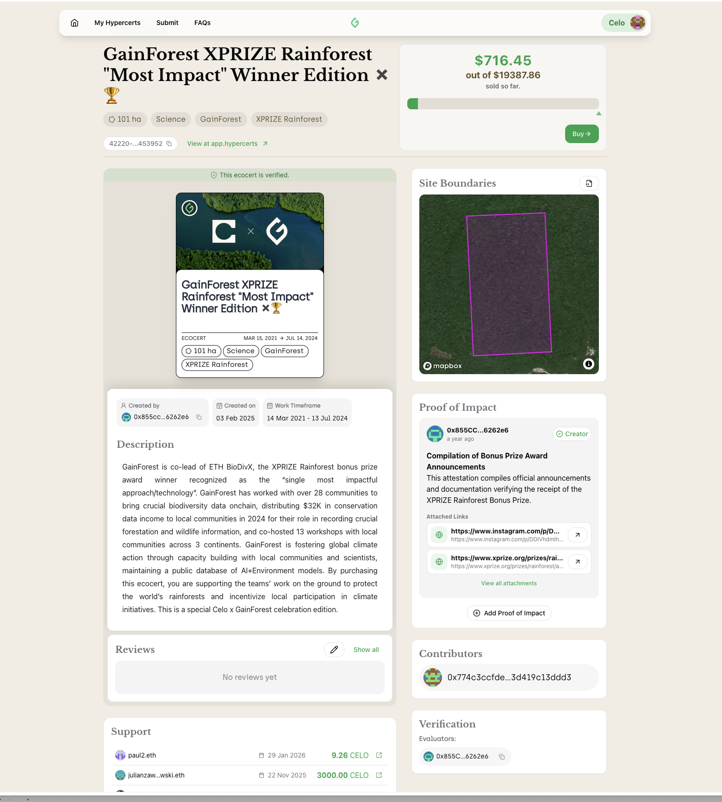

# Scaling Ecocerts: Getting Conservation Funding to the People Who Do the Work

How could crypto be used for good? That was the initial question that got me into this work.

I came to that question sideways. I'd studied civil and environmental engineering because I wanted to work on the environment through the built world — how we design roads, water systems, buildings so that people and ecosystems can actually coexist rather than compete. But the longer I spent on it, the more I noticed that the hard part usually wasn't the engineering. We often knew what to build. What decided whether it got built, and for whom, was the money.

That question led me to [GainForest](https://www.gainforest.app/en), a nonprofit that aims to channel funding to the nature stewards where conservation is actually happening. The funding problem here is bureaucratic and structural. A great deal of money flows toward conservation every year, yet very little of it reaches the communities that do the hard work.

In order for a project to get off the ground, they need to first source funding. For this you need to speak the language of impact reporting. Impact should be demonstrated in a form the funder recognizes. Markets want certification, auditors, methodologies, a paper trail. Philanthropy wants a grant proposal — a theory of change, a budget, and quarterly reports. Navigating this requires its own expertise, which discourages projects and slows down the entire process. Spending time on this means taking time away from the real work that needs to be done.

What if we could make it easy to do this work and get paid for it?

## Hypercerts: Impact Certificates

It was through that thread that I came across [Hypercerts](https://hypercerts.org/).

Hypercerts is an open, interoperable standard for impact certificates that came out of the Ethereum ecosystem. The idea is to take a verified outcome and represent it as something legible and ownable: a funder can see what they are supporting, and a community can be paid for producing it. Putting these certificates on-chain makes each outcome verifiable, stops the same impact from being counted or sold twice, and means no single institution has to be trusted as the arbiter of what's true.

[Devansh, another Next Billion fellow](/fellowship/Devansh), had taken the same idea and built VoiceDeck, a Hypercerts marketplace for journalism, where a reader can fund a piece of reporting that has already been done.

Seeing it work is what made it click. The same shape could work for the people protecting forests. VoiceDeck is open source, so we forked it and started from there.

## GainForest's early days

A certificate is only as good as the evidence behind it. How do we attach meaningful data to the certificates?

Remote sensing is powerful (satellites can tell you a great deal about whether a forest is intact), but the people living in a place know it best. We decided to treat local stewards as part of the system, training them to collect and validate data, and paying them directly.

The first iteration of GainForest's work was about proving this was viable. Nature stewards started by taking pictures on the ground, which we displayed on an interactive globe, so the places being protected were visible to anyone. We paid communities to showcase the work that they have already been doing.

We also tested this in the Amazon, sending communities crypto directly through MiniPay, a mobile wallet built for that kind of access. That work helped us win an XPRIZE bonus prize in 2024 and the endowment fund that came with it, and over time we expanded from a single forest to work across three continents.

## The fellowship: scaling Ecocerts

*ecocertain.xyz, the first iteration of an environmental hypercert marketplace*

In late 2024 GainForest built [Ecocertain](https://github.com/GainForest/ecocertain), an on-chain marketplace for environmental impact certificates. This app has now been deprecated (you'll read more about why in this article), but what we learned from it became a second version, now simply [gainforest.app](https://www.gainforest.app/). My Next Billion Fellowship project has been about scaling this work. How can we scale the number of people who can take part in funding and receiving funds for environmental impact?

We worked on this first version, which was exclusively crypto-only, for close to a year. As many communities were unfamiliar with crypto, we needed to teach them how to use our app. We hosted online workshops, and walked people through wallets and seed phrases individually. We worked hard to lower the barrier to entry. We used Celo, an Ethereum L2, in countries where local off-ramps exist.

Towards the end of this year, Ecocertain moved just under $26,000 in total across 36 projects. While a great start, it is not a funding mechanism at the scale the problem needs.

Onboarding was only part of the problem. A crypto-only product reaches only crypto-native users, which is a small pool. We should meet people where they are, without needing to teach them about seed phrases. We shouldn't forget that the ultimate goal is to reach more of the people that the funding is meant for.

Reaching Ethereum's next billion means separating the mechanisms this ecosystem produced from the rails that may intimidate a first-time user. We can take the mechanisms that work, and use crypto in the areas that make sense.

## Lesson 1: Bringing Ethereum's ideas to people who will never touch a wallet

Quadratic funding is a good example. It was incubated in the Ethereum ecosystem, but it is really just a way of letting many small contributions steer a larger matching pool. The projects a crowd cares about draw more support, not just the ones a big funder happens to pick.

Hypercerts, or impact certificates are another idea worth carrying across. A Hypercert is simply a standard, interoperable way to represent a data-backed real world outcome so it can be owned and funded. Because the standard is shared, a certificate created in one place can be recognized and funded in another.

These are concepts that can be applied beyond the crypto ecosystem.

## Lesson 2: Putting crypto rails where they are the only thing that works

For projects in countries without banking access, or where cross-border transfer is not possible or has prohibitive costs, crypto is necessary. In this case, the barrier is the traditional banking infrastructure, and crypto is the solution. Ethereum earns its place in this scenario as an infrastructure that finally allows a community to get paid internationally. It would be more useful to think of crypto not as a full replacement for the financial infrastructure, but as an addition to it.

## Lesson 3: Scaling the network

No single platform can do everything, and collaboration is essential. In early 2026 I joined Ma Earth to help build a platform that runs quadratic-funding rounds for conservation in fiat currency. Ma Earth had previously hosted its rounds exclusively in crypto, on the Gitcoin platform. The results have exceeded our expectations. Rounds 1 and 2 crowdfunded roughly $20,000 and $30,000, averaging about $1,000 per project. Round 3, the first hosted entirely in fiat, raised $996,804 across a much larger applicant pool, crowdfunding close to $5,000 per project.

The goal is to meet funders on whichever rail they already use. Hosting the round entirely using fiat also came with its own set of regulations and challenges. For example, banking systems are not the same in every part of the world. Over half of the accepted projects needed fiscal sponsors in order to help them receive the funds. In addition, Ma Earth only allowed credit card donations, and other countries, who for example use mobile money, or who can not pay the expensive banking fees, were inadvertently excluded from donating.

Hosting future rounds in both fiat and crypto will help bridge the financial gap for all.

## Lesson 4: Making it easy to apply for funding through data interoperability

Sourcing and applying for funding is hard work. It prevents many projects from getting started, or from continuing their work.

Just as receiving money shouldn't require a wallet and a seed phrase, applying to grants shouldn't mean re-entering the same information over and over in different siloed platforms. Right now every platform has its own data standard and its own application form. A community protecting a forest should be able to describe its work once and put it in front of many funders, something close to one-click.

Blockchains have always leaned on a second system for the data they can't hold on-chain, and that role has typically gone to IPFS. Hypercerts has previously stored their impact data either on-chain, or in IPFS. The solution is an open data layer where different standards can talk to each other, and to wrap up the work the projects have done in an impact certificate.

I joined the Hypercerts Foundation in July 2025 to work on exactly this question of how to scale Hypercerts. By September we had converged on using [AT Protocol](https://atproto.com/) as our data layer. The paper on [Decentralized Social Media](https://arxiv.org/abs/2402.03239) echoes what we had spent a year learning the hard way: decentralized systems collapse when they make users pay for the decentralization. [AT Protocol plays that role as a public, interoperable data layer](https://www.gainforest.app/en/docs/architecture).

A steward's observations, photos, and field notes can now live in records that aren't restricted to one platform. Another tool can index the same data, a funder can query and analyze it to come to their own conclusion. Additionally, since the identifier the steward publishes under stays theirs across all of it, the steward's track record accumulates instead of resetting each time they move. AT Protocol also puts portability first. Your identity and your records are yours, and you can leave a host without losing either.

Proving your work should be as easy as posting on social media. Take the photo, write the note, publish. Billions of people already know how to do this.

## What we kept

A year of building crypto-only taught us which parts were worthwhile to keep and which ones weren't. Quadratic funding, impact certificates, data interoperability are concepts that hold up on their own.

## Looking ahead

We want communities earning a living wage for the work of stewardship, and funders who can see the real impact of what they back. Two things stand in the way.

The first is a shared data layer. Until more organizations adopt one, every community has to describe its work over and over for each new platform. With interoperability, they describe it once and everyone can read and evaluate it, and we build on each other's work instead of duplicating it.

The second is scale. We've managed to reach a major milestone of close to $1 million crowdfunded in one round. The next ones will have to move ten, then a hundred, for us to be able to adequately fund nature. The user experience is essential. A funder should be able to find work worth backing and understand it in a few minutes, and a steward should be able to quickly prove their work without having to jump through hurdles.

You can follow our journey moving forward on [gainforest.app](https://www.gainforest.app/).
